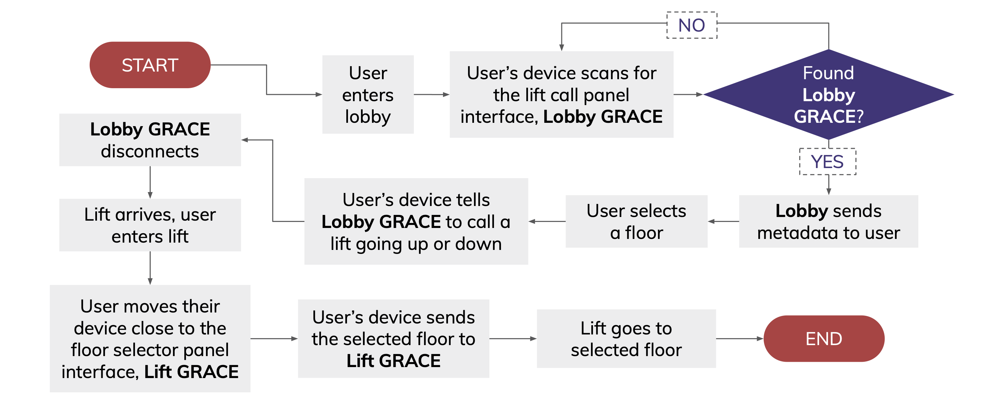

# GRACE
## A new way to interact with elevators

> By **Can I have a breakout room?**
> - [Rui Yang](https://github.com/thinkerpal/)
> - [Jia Chen](https://github.com/jiachenyee/)
> - [Sebastian](http://github.com/SebasChoo04/)
> - [Xenos](https://github.com/xenosf/)
> - [Cheryl](https://github.com/Cheryl-L/)

This is a code submission for the [Brainhack 2021 CODE_EXP Competition](http://codeexp.tk.sg)

---

## What is GRACE?
GRACE stands for:

 **G**eneral - compatible with many lifts throughout Singapore

 **R**emotely - operated directly from users' mobile phones

 **A**ccesible - features cater to the visually impairsed

 **C**ontactless - reduce contact points to decrease risk of disease transmission

 **E**levators - Elevator!!!

## Why GRACE?
### Problem Statement
**“How can we better adjust and adapt into New Norms in a Post-Covid world?”**

> The world was hit by Covid-19 and we have been compelled to experience an unprecedented shift in our lifestyle and the need to adapt to various new norms. Adjusting to changes can pose quite a challenge, especially when it affects our daily routine, be it the way we work and study, or the way we socialise and connect. However, adaptation is inevitable as Covid-19 may be here to stay and has, and will continue to change the way we live.

> The CODE_EXP 2021 problem statement focuses on the possible ways to better aid people in adjusting and adapting to new norms in this post-pandemic world. The targeted benefitting group may include the general public or vulnerable groups such as the elderly, patients in clinics/hospitals, and medical staff.

### What we've identified
Given that COVID-19 is likely to be endemic, we would need to incorporate new norms into our daily lives, such as an increased consciousness of hygiene, and heightened measures to reduce risk of disease transmission like safe distancing, are here to stay

However, not everyone is able to adapt well to these changes, and certain groups of people may face greater difficulties and be 'left behind'

### Problem Scope
> Reducing the risk of disease transmission in public spaces via high contact points such as lift buttons, through an app that allows fully contactless interaction with controls that are accessible to the visually impaired

### Target Audience 
- Visually Impaired people
    - These people rely on touch to navigate (eg. by reading Braille or embossed text), leading to a higher risk of disease spread by touching public surfaces
        - Current measures to reduce contact in public surfaces such as holographic/hover lift buttons are not accessible to these people
    - Not all are able to navigate using touch, and rely on verbally asking other for help. This is difficult when close contact is discouraged
        - This results in them being more dependent on others
- General public
    - Reduce overall risk of transmission in places like HDB flats, preventing clusters arising from spread of disease through touching public surfaces

## Technical Details

### Requirements
- Xcode 12.5
- iOS 13 and up
- 2 micro:bit v1 or v2

### Technologies used:
- [BBC micro:bit v2](https://microbit.org)
    - This is used to simulate the hardware lift and lobby interface in our prototype
- [Swift/Xcode](https://developer.apple.com/swift)
    - IDE of choice for iOS App Development
- [UIKit](https://developer.apple.com/documentation/uikit)
    - Used for front-end Development
- [CoreBluetooth](https://developer.apple.com/documentation/corebluetooth)
    - Used in communications between the micro:bit and iPhone
- MS-DOS
    - Custom built interface between the micro:bit and Swift. 
    - It integrates directly into [CoreBluetooth](https://developer.apple.com/documentation/corebluetooth) and abstracts most of [CoreBluetooth](https://developer.apple.com/documentation/corebluetooth) boilerplate functions and manages pairing.

### Technical Flowchart

## Deploying GRACE
1. Clone the repo
2. Using Xcode 12.5, open the `GRACE.xcodeproj` file.
    - There are no external packages used for this project
3. Run it on a **physical** iOS device
4. Flash the first micro:bit with the `Lift.hex` file. This will be referred to as the `Lift GRACE` from this point.
5. Flash the second micro:bit with the `Lobby.hex` file. This will be referred to as the `Lobby GRACE` from this point.
6. The `Lift GRACE` will be placed in the lift and can be distinguished by the radial-style animations
7. The `Lobby GRACE` will be placed in the lobby and can be distinguished by the square-style animations
8. Launch the app!
    - Optionally, 
        - you can go to Settings > Accessibility > VoiceOver and turn it on.
        - this will provide you with an experience akin to what someone with visual imparements
        - swipe left and right to toggle between UI elements and double-tap to select them.
9. Walk into the lobby with the app open and it would instantly connnect to the `Lobby GRACE` and prompt for which floor to travel to
10. When a lift arrives, walk in and the app would take about 3s to pair with the `Lift GRACE` and automatically select the floor to head to.
