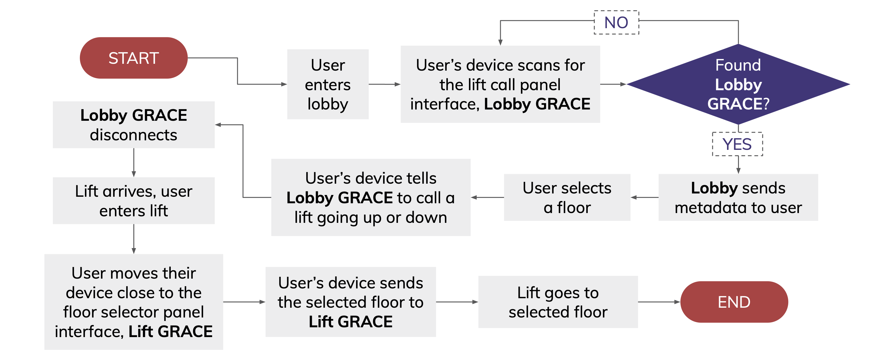

# GRACE
This is a code submission for the Brainhack 2021 CODE_EXP Competition

---

## What is GRACE?
GRACE stands for:

 **G**eneral

 **R**emotely

 **A**ccesible

 **C**ontactless

 **E**levators

## Why GRACE?
### Problem Statement:
**“How can we better adjust and adapt into New Norms in a Post-Covid world?”**

> The world was hit by Covid-19 and we have been compelled to experience an unprecedented shift in our lifestyle and the need to adapt to various new norms. Adjusting to changes can pose quite a challenge, especially when it affects our daily routine, be it the way we work and study, or the way we socialise and connect. However, adaptation is inevitable as Covid-19 may be here to stay and has, and will continue to change the way we live.

> The CODE_EXP 2021 problem statement focuses on the possible ways to better aid people in adjusting and adapting to new norms in this post-pandemic world. The targeted benefitting group may include the general public or vulnerable groups such as the elderly, patients in clinics/hospitals, and medical staff.

### What we've identified
Given that COVID-19 is likely to be endemic, we would need to incorporate new norms into our daily lives, such as an increased consciousness of hygiene, and heightened measures to reduce risk of disease transmission like safe distancing, are here to stay

However, not everyone is able to adapt well to these changes, and certain groups of people may face greater difficulties and be 'left behind'

### Problem Scope
> Reducing the risk of disease transmission in public spaces via high contact points such as lift buttons, through an app that allows fully contactless interaction with controls that are accessible to the visually impaired

## Technical Details

### Technologies used:
- BBC micro:bit v2
    - This is used to simulate the lift interface in our prototype
- Swift/Xcode
    - IDE of choice for iOS App Development
- UIKit
    - Used for front-end Development
- CoreBluetooth
    - Used in communications between the micro:bit and iPhone

### Technical Flowchart

